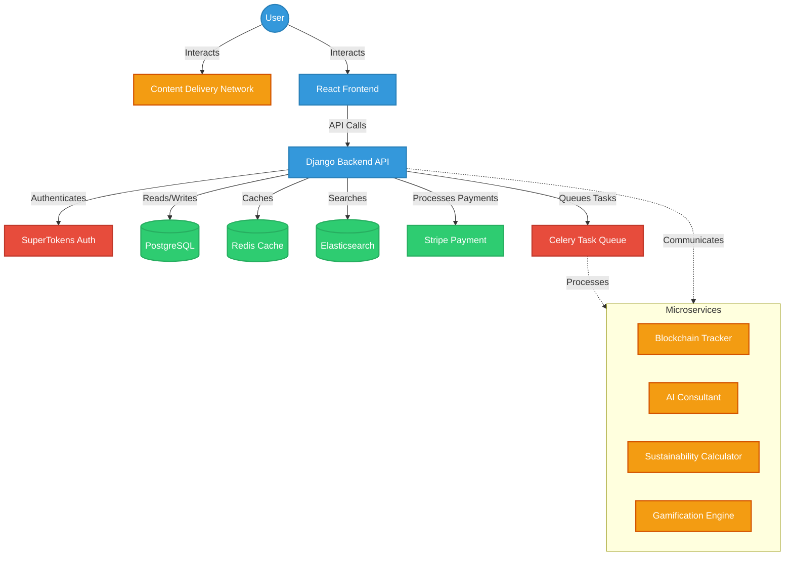

# Ecolaura Architecture Overview

## Introduction

Ecolaura is a microservices-based e-commerce platform designed for scalability, maintainability, and performance. This document provides a high-level overview of the system architecture.

## System Components

1. Frontend Application
2. Backend API
3. Microservices
4. Databases
5. Caching Layer
6. Search Engine
7. Message Queue
8. Payment Gateway
9. Content Delivery Network (CDN)

## Architecture Diagram

## Component Details

### 1. Frontend Application
- Technology: React
- Responsibilities:
  - User interface rendering
  - State management
  - API integration

### 2. Backend API
- Technology: Django with Django REST Framework
- Responsibilities:
  - Handle API requests
  - Business logic implementation
  - Data validation and processing

### 3. Microservices
- Technologies: Python, Go (depending on service requirements)
- Key Services:
  - Blockchain Tracker: Product lifecycle tracking
  - AI Consultant: Virtual sustainability advisor
  - Sustainability Calculator: Compute and track sustainability metrics
  - Gamification Engine: Manage eco-challenges and rewards

### 4. Databases
- Primary Database: PostgreSQL
- Responsibilities:
  - Store relational data (users, products, orders, etc.)

### 5. Caching Layer
- Technology: Redis
- Responsibilities:
  - Cache frequently accessed data
  - Session storage

### 6. Search Engine
- Technology: Elasticsearch
- Responsibilities:
  - Power product search functionality
  - Enable advanced filtering and faceted search

### 7. Message Queue
- Technology: Celery with Redis as broker
- Responsibilities:
  - Handle asynchronous tasks
  - Ensure system reliability and scalability

### 8. Payment Gateway
- Technology: Stripe
- Responsibilities:
  - Process secure payments
  - Handle subscription billing

### 9. Content Delivery Network (CDN)
- Responsibilities:
  - Serve static assets
  - Improve global performance

## Data Flow

1. User interacts with React frontend
2. Frontend makes API calls to Django backend
3. Backend processes requests, interacting with databases and microservices as needed
4. Asynchronous tasks are queued via Celery for background processing
5. Search requests are handled by Elasticsearch
6. Static content is served via CDN

## Scalability and Performance

- Horizontal scaling of microservices and API servers
- Caching frequently accessed data in Redis
- Use of CDN for static asset delivery
- Asynchronous processing of non-critical tasks

## Security Considerations

- HTTPS for all communications
- JWT-based authentication using SuperTokens
- Regular security audits and penetration testing
- Compliance with data protection regulations (GDPR, CCPA)

## Monitoring and Logging

- Centralized logging system
- Real-time monitoring and alerting
- Performance metrics tracking

## Deployment

- Containerization using Docker
- Orchestration with Kubernetes
- CI/CD pipeline for automated testing and deployment

## Future Considerations

- Potential migration to serverless architecture for certain components
- Implementation of machine learning models for personalized recommendations
- Exploration of blockchain technology for supply chain transparency