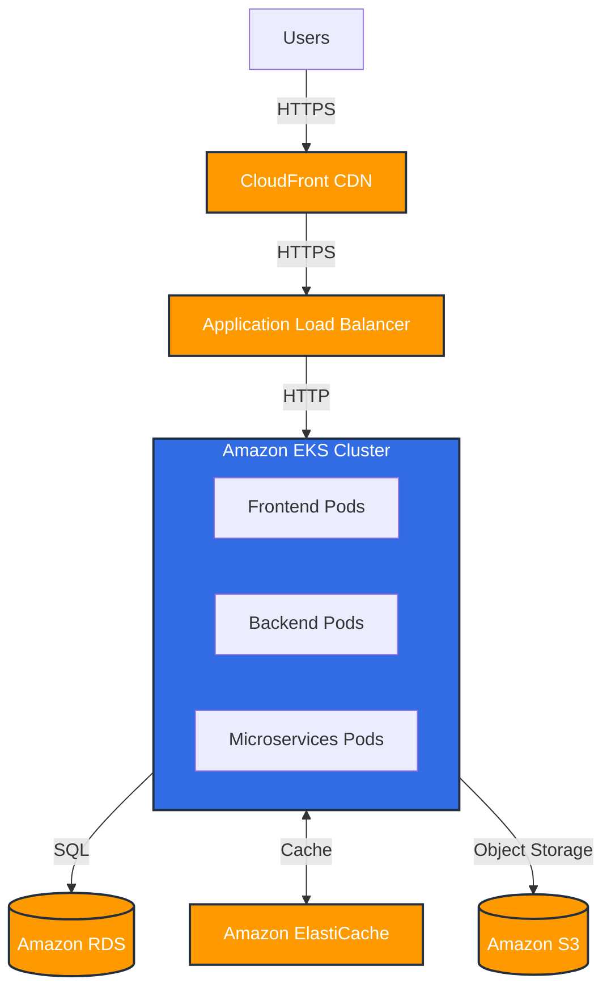

# 🏡 Ecolaura Hosting Infrastructure: Our Digital Ecosystem's Habitat


Welcome to Ecolaura's Hosting Infrastructure documentation! Just as a thriving forest needs the right environmental conditions, our platform requires a robust, scalable, and efficient hosting setup. Let's explore the digital habitat that nurtures our sustainable e-commerce ecosystem! 🌿☁️


## 🌍 Overview


Ecolaura's hosting infrastructure is designed to be:

- Scalable to accommodate growth

- Resilient to ensure high availability

- Efficient to minimize our carbon footprint

- Secure to protect our users and data


Our infrastructure is like a carefully balanced ecosystem, where each component plays a vital role in supporting the whole.


## 🌳 Cloud Provider


We've chosen Amazon Web Services (AWS) as our primary cloud provider for its:

- Comprehensive suite of services

- Global presence for low-latency access

- Commitment to sustainability (100% renewable energy goal)


## 🗺️ Architecture Diagram

Here's a high-level overview of our hosting architecture:




## 💻 Compute Resources


We use Amazon EKS (Elastic Kubernetes Service) to orchestrate our containerized applications:


- **Cluster Configuration**:

 - 3 worker node groups (2 on-demand, 1 spot instance group)

 - Auto-scaling enabled (min: 3, max: 20 nodes per group)

 - Instance types: t3.large for consistent workloads, c5.xlarge for compute-intensive tasks


- **Deployment Strategy**:

 - Blue-Green deployments for zero-downtime updates

 - Horizontal Pod Autoscaler for automatic scaling based on CPU/memory usage


Example Kubernetes deployment:


```yaml

apiVersion: apps/v1

kind: Deployment

metadata:

 name: ecolaura-backend

spec:

 replicas: 3

 selector:

  matchLabels:

   app: ecolaura-backend

 template:

  metadata:

   labels:

    app: ecolaura-backend

  spec:

   containers:

   - name: ecolaura-backend

    image: ecolaura-backend:latest

    resources:

     limits:

      cpu: 500m

      memory: 512Mi

     requests:

      cpu: 200m

      memory: 256Mi

```


## 🗃️ Database Hosting


We use Amazon RDS (Relational Database Service) for our primary database:


- **Database Engine**: PostgreSQL 13

- **Instance Type**: db.r5.xlarge (scalable based on demand)

- **High Availability**: Multi-AZ deployment for automatic failover

- **Backups**: Daily automated backups with 14-day retention

- **Performance Insights**: Enabled for query performance monitoring


For caching and session storage, we use Amazon ElastiCache:


- **Engine**: Redis 6.x

- **Node Type**: cache.m5.large

- **Cluster Configuration**: 3-node cluster with Auto-Failover


## 🌐 Content Delivery Network (CDN)


We leverage Amazon CloudFront as our CDN to ensure fast, global content delivery:


- **Origins**: S3 for static assets, ALB for dynamic content

- **Behaviors**: Caching optimized per content type

- **Security**: HTTPS enforced, AWS WAF integrated for additional protection


## ⚖️ Load Balancing and Auto-Scaling


- **Application Load Balancer (ALB)**: 

 - Routes traffic to EKS cluster

 - SSL/TLS termination

 - WebSocket support for real-time features


- **Auto-Scaling**:

 - EKS Cluster Autoscaler adjusts node count

 - Horizontal Pod Autoscaler scales pod replicas


## 🔄 Backup and Disaster Recovery


- **Database**: 

 - Point-in-time recovery enabled

 - Cross-region read replicas for disaster recovery


- **Application State**: 

 - Stored in S3 with cross-region replication


- **Disaster Recovery Plan**:

 - Regular DR drills

 - Automated failover to secondary region


## 📊 Monitoring and Alerting


We use a combination of AWS native and third-party tools:


- **Amazon CloudWatch**: 

 - Metrics, logs, and alarms for AWS resources

 - Custom metrics for application-specific monitoring


- **Prometheus & Grafana**: 

 - Detailed Kubernetes and application metrics

 - Custom dashboards for real-time monitoring


- **Alerting**: 

 - PagerDuty integration for critical alerts

 - Slack notifications for non-critical issues


## 🔒 Security Measures


- **Network Security**:

 - VPC with private and public subnets

 - Security groups and NACLs for fine-grained access control


- **Data Encryption**:

 - At-rest: EBS, S3, and RDS encryption enabled

 - In-transit: TLS for all data transmission


- **Access Management**:

 - IAM roles and policies following principle of least privilege

 - MFA enforced for all AWS console access


- **Compliance**:

 - Regular security audits and penetration testing

 - Compliance with GDPR, PCI DSS as applicable


## 💰 Cost Optimization


We implement several strategies to optimize costs without compromising performance:


- **Reserved Instances**: For predictable, long-term workloads

- **Spot Instances**: For fault-tolerant, flexible workloads

- **Auto-Scaling**: To match resource provisioning with demand

- **S3 Intelligent-Tiering**: For optimal storage cost based on access patterns

- **Regular Cost Analysis**: Using AWS Cost Explorer and third-party tools


## 🌱 Future Infrastructure Plans


As Ecolaura grows, we're planning to:


1. Explore multi-cloud strategies for increased resilience

2. Implement serverless architectures for suitable workloads

3. Enhance our observability stack with distributed tracing

4. Further optimize for sustainability, aiming for carbon-neutral hosting


By continuously refining our hosting infrastructure, we ensure that Ecolaura has a robust, efficient, and sustainable digital habitat. Just as a healthy forest supports diverse life, our well-architected infrastructure supports the growth and innovation of our platform. Together, we're cultivating a resilient digital ecosystem for sustainable e-commerce! 🌿🏗️🌍