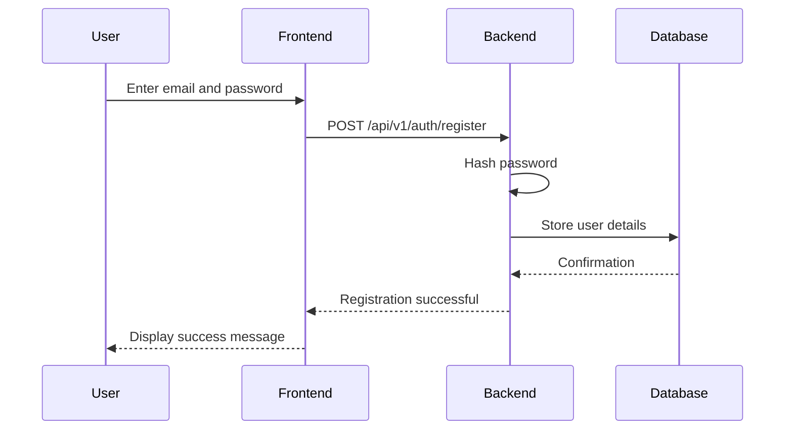
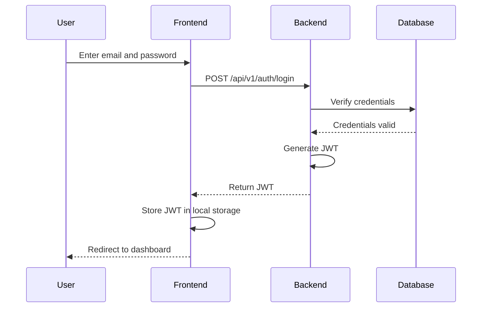
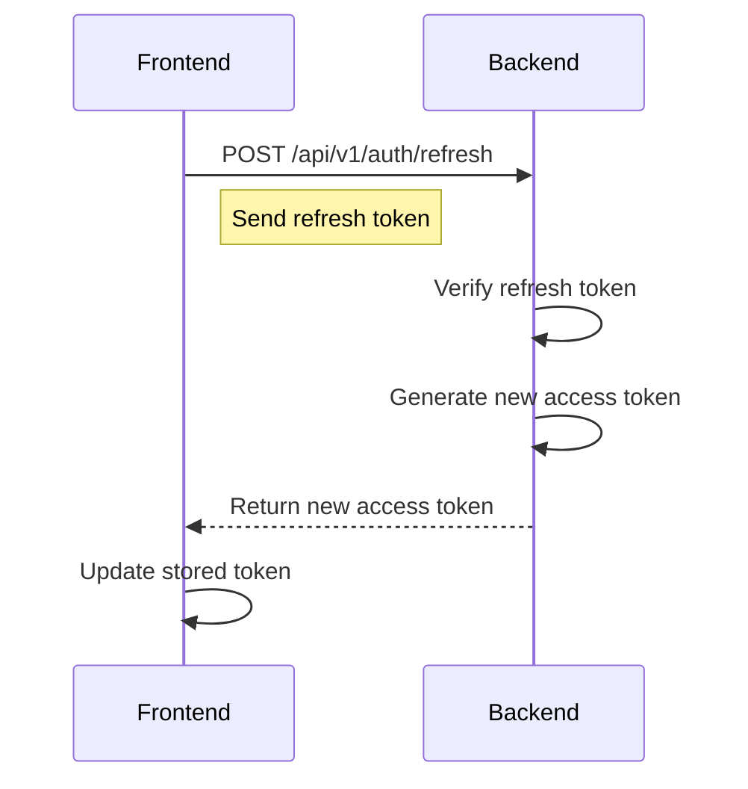
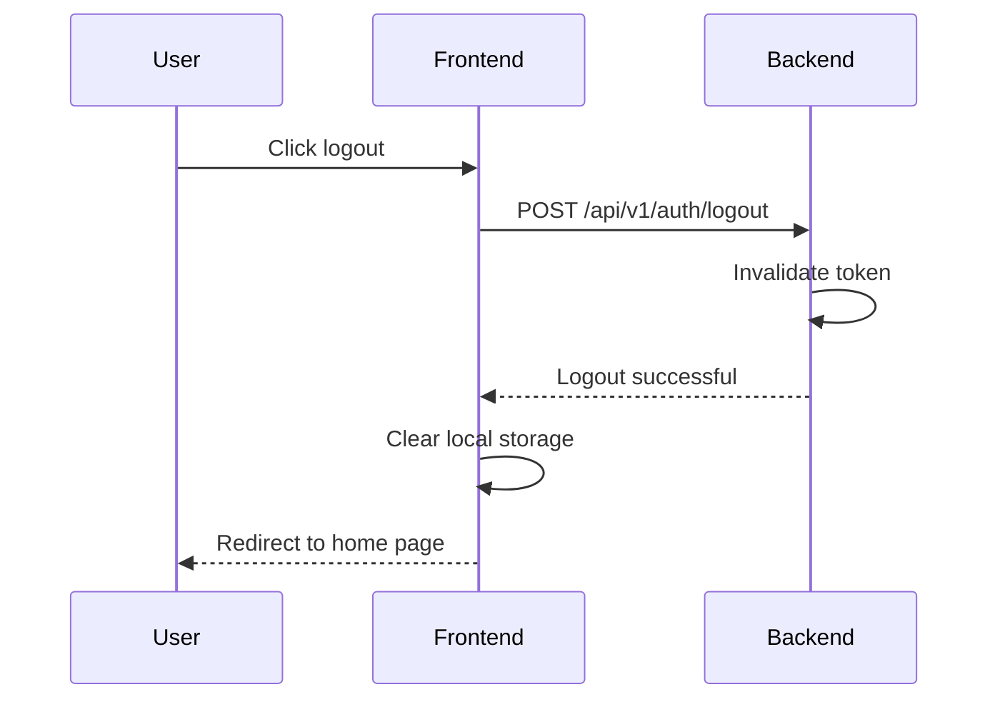

# 🔐 Ecolaura Authentication Flow: Securing Our Green Oasis


Welcome to Ecolaura's Authentication Flow documentation! Just as we protect our environment, we're committed to safeguarding our users' data and access. Let's dive into how we keep our digital ecosystem secure and thriving! 🌿🛡️


## 🎯 Overview


Ecolaura uses a robust, token-based authentication system to ensure secure access to our platform. We implement JWT (JSON Web Tokens) for stateless authentication, coupled with secure password hashing and HTTPS encryption for all data in transit.


## 🔄 Authentication Process


1. User Registration

2. User Login

3. Token Generation

4. Authenticated Requests

5. Token Refresh

6. Logout


Let's break down each step:


### 1. User Registration


Users provide their email and password to create an account.





### 2. User Login


Users enter their credentials to obtain an access token.





### 3. Token Generation


The server generates a JWT containing the user's ID and roles.


```javascript

const jwt = require('jsonwebtoken');


function generateToken(user) {

 return jwt.sign(

  { id: user.id, email: user.email, roles: user.roles },

  process.env.JWT_SECRET,

  { expiresIn: '1h' }

 );

}

```


### 4. Authenticated Requests


The client includes the JWT in the Authorization header for subsequent requests.


```javascript

axios.get('https://api.ecolaura.com/v1/user/profile', {

 headers: {

  'Authorization': `Bearer ${localStorage.getItem('token')}`

 }

})

.then(response => console.log(response.data))

.catch(error => console.error('Error:', error));

```


### 5. Token Refresh


To maintain seamless user sessions, we implement token refreshing.





### 6. Logout


Logging out invalidates the user's tokens.





## 🚀 API Endpoints


### Register


```

POST /api/v1/auth/register

```


Request Body:

```json

{

 "email": "eco_warrior@example.com",

 "password": "SecureGreenPassword123!",

 "name": "Eco Warrior"

}

```


Response:

```json

{

 "message": "Registration successful",

 "userId": "user_123abc"

}

```


### Login


```

POST /api/v1/auth/login

```


Request Body:

```json

{

 "email": "eco_warrior@example.com",

 "password": "SecureGreenPassword123!"

}

```


Response:

```json

{

 "accessToken": "eyJhbGciOiJIUzI1NiIsInR5cCI6IkpXVCJ9...",

 "refreshToken": "eyJhbGciOiJIUzI1NiIsInR5cCI6IkpXVCJ9...",

 "expiresIn": 3600

}

```


### Refresh Token


```

POST /api/v1/auth/refresh

```


Request Body:

```json

{

 "refreshToken": "eyJhbGciOiJIUzI1NiIsInR5cCI6IkpXVCJ9..."

}

```


Response:

```json

{

 "accessToken": "eyJhbGciOiJIUzI1NiIsInR5cCI6IkpXVCJ9...",

 "expiresIn": 3600

}

```


### Logout


```

POST /api/v1/auth/logout

```


Response:

```json

{

 "message": "Logout successful"

}

```


## 🛡️ Security Measures


1. **Password Hashing**: We use bcrypt for secure password hashing.

2. **HTTPS**: All API requests are made over HTTPS to encrypt data in transit.

3. **JWT Secret**: Our JWT secret is stored securely and rotated regularly.

4. **Token Expiration**: Access tokens have a short lifespan (1 hour) to minimize the impact of token theft.

5. **Refresh Token Rotation**: Refresh tokens are rotated with each use to prevent reuse.


## 💡 Best Practices


1. **Never store tokens in cookies**: Store them in memory or secure local storage.

2. **Implement token refresh logic**: Silently refresh tokens before they expire for a seamless user experience.

3. **Validate tokens on the server**: Always verify token integrity and expiration on the server-side.

4. **Use secure password policies**: Enforce strong passwords with a combination of characters, numbers, and symbols.

5. **Implement rate limiting**: Prevent brute-force attacks by limiting login attempts.


## 🐛 Common Issues and Solutions


1. **Issue**: Token expired during user session

  **Solution**: Implement automatic token refresh in your frontend logic


2. **Issue**: Unauthorized access attempts

  **Solution**: Log and monitor failed authentication attempts, implement temporary account lockouts


3. **Issue**: JWT secret compromised

  **Solution**: Immediately rotate the JWT secret and invalidate all existing tokens


## 🔮 Future Enhancements


1. **Multi-factor Authentication (MFA)**: Add an extra layer of security for user accounts

2. **OAuth Integration**: Allow users to sign in with their Google or Apple accounts

3. **Biometric Authentication**: Implement fingerprint or face recognition for mobile apps

4. **Passwordless Authentication**: Explore email magic links or WebAuthn for a password-free experience


## 🤝 Contributing


Think you can make our authentication even more secure? We're all ears! Here's how you can contribute:


1. **Security Audits**: Help review and improve our authentication processes

2. **Performance Optimization**: Suggest ways to make our auth flow more efficient

3. **User Experience**: Propose ideas to make the auth process more user-friendly while maintaining security


Remember, robust authentication is the foundation of a secure and trustworthy platform. Let's work together to keep Ecolaura safe and accessible for all our eco-warriors! 🌿🔒🌍